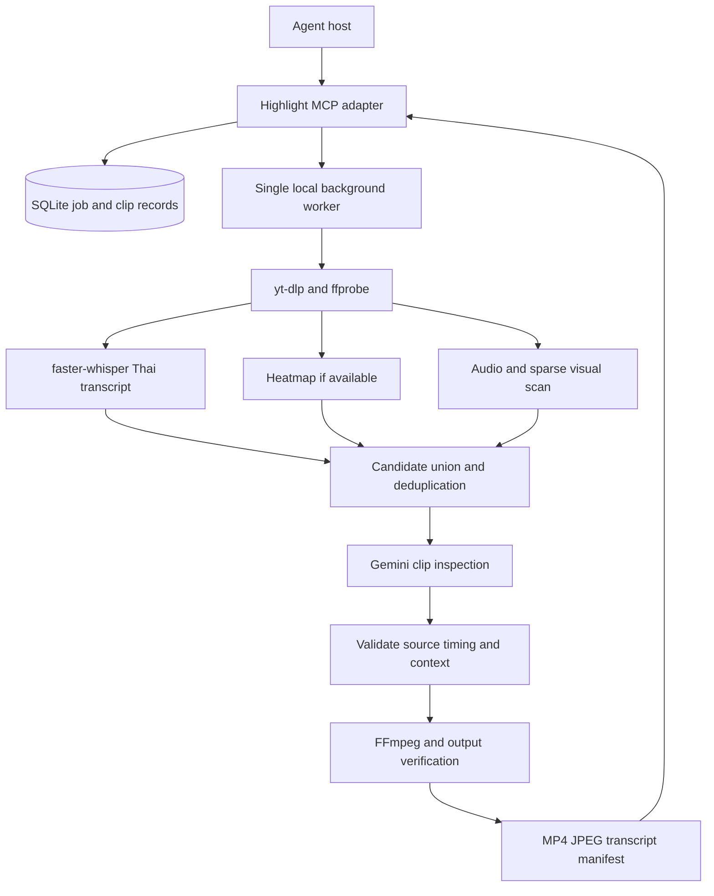

# Architecture

## Decisions

Thin Python MCP adapter + local worker + SQLite WAL + filesystem artifacts. Use official MCP Python SDK; select and pin a released compatible version when runtime starts. Do not implement JSON-RPC manually. Target standard tools/resources and stdio first; native MCP Tasks and remote Streamable HTTP are later capabilities, not prerequisites.

Agent decides intent and presents results. Deterministic service owns downloads, checkpoints, timing, filesystem writes, rendering and retries. Gemini returns structured proposals, never executable commands. MCP connection ending does not cancel queued work.

## Worker lifecycle

Adapter ensures a per-data-directory worker exists under an exclusive startup lock; Windows launch is hidden. SQLite lease heartbeat prevents two processes owning one job. Worker inherits a snapshotted, server-side configuration and secret reference. No keys in argv/database. Environment-key changes require worker restart; config version is recorded per job.

State: queued → running → completed / partial / failed / cancelled. running has stage: preflight, ingest, transcribe, discover, inspect, render, verify. waiting_for_configuration and waiting_for_budget pause new chargeable actions; retry resumes after user fixes the prerequisite. interrupted is recovery state for expired leases. cancel_requested cooperatively stops work and subprocess trees; already transmitted provider work may still be billed.

Crash recovery: every stage writes temp artifacts then atomically promotes and checkpoints content hashes. Expired lease -> interrupted; on reacquire validate cached artifacts. Resume deterministic local work. An API timeout with uncertain billing is recorded provider_outcome_unknown, not blindly reissued; explicit retry may incur additional cost. Stop after bounded attempts. No automatic destructive cleanup during active work.

## Pipeline

1. **Preflight:** validate key presence/model capability, executable versions, writable data dir, disk and duration limits. A provider connectivity check is separate from local readiness. Never report key validity merely from its presence.
2. **Ingest:** get metadata + heatmap; download one source and checksum it. Use yt-dlp Python/argument-array invocation, no shell. Enforce time/size limits while downloading. Do not log signed URLs/cookies. Access failure is SOURCE_UNAVAILABLE; do not automatically load browser cookies.
3. **Transcript:** transcribe original Thai, word/segment times in source seconds. Thai word boundaries are estimates, not truth. Keep uncertain names/spans; glossary only helps disambiguation, not rewrite quotes. Speaker diarization optional, labels are anonymous unless explicitly verified. Cache by source checksum + ASR model/version/settings.
4. **Context map:** segment transcript into overlapping topic windows, keep a brief source-grounded episode map. Full transcript remains queryable locally; do not truncate each candidate to a fixed 200 characters.
5. **Candidate discovery:** union heatmap local maxima, transcript-based important/funny candidates, non-speech audio events and sparse frame observations. Reserve an initial 30% of inspection budget for non-heatmap candidates; redistribute if unavailable. Loudness alone is not laughter. Focus ranges strictly bound candidate discovery; expansion outside them is forbidden unless the user changes them. Preview/sample scans can miss silent jokes; record coverage.
6. **Heatmap:** read actual start/end/value bins, never assume 100 bins or second-level accuracy. Merge adjacent high bins into events, apply time-based non-maximum suppression. Include lead-in/out. If mode=require and graph is unavailable, stop with HEATMAP_UNAVAILABLE; prefer falls back; ignore skips it.
7. **Inspection:** send bounded clips with audio and episode context to Gemini. Evidence includes literal quotes/transcript IDs and observed reactions. Revisit suspected fast reactions at higher sampling density. Record exact model, prompt version, media sampling and inspected intervals.
8. **Temporal grounding:** model relative timestamps + excerpt offset -> absolute source times. Reject NaN, negative, inverted and outside-source values. Snap near speech pauses/transcript boundaries, then inspect opening and closing context. Never trust a model timestamp as frame-accurate. Respect requested min/max; if coherent context cannot fit, omit candidate and explain.
9. **Selection:** independent humor, importance, replay and context-completeness dimensions; do not blend into a claimed virality probability. Replay score is observed input; AI confidence is uncalibrated judgment. Deduplicate by temporal overlap and same-event evidence; category diversity is a tie breaker. Unknown evidence stays null. Persist why rejected candidates were rejected.
10. **Render:** decode and re-encode validated source range for precise cuts (no naive stream-copy cuts at arbitrary times). Keep 16:9 layout; vertical fits/pads entire scene in v1. Optional SRT is regenerated relative to clip start. Do not put AI-written speech into subtitles.
11. **Verify:** ffprobe streams/duration, decode output, compare first/last content with intended source, check audio continuity and caption bounds. Successful render process alone is insufficient. Individual failures yield partial if other clips verify, failed if none render, or completed empty if no candidates met editorial criteria.

## Persistence

Tables: videos (canonical ID, source hash, metadata), jobs (normalized request, state, stage, lease, config version), attempts (external call ID/usage/outcome), candidates (ranges/evidence/rejection), clips (revision, source times, verification), artifacts (type, hash, size, expiration), events (sanitized status changes).

Job request fingerprint = canonical source + resolved options + pipeline/model/prompt versions. Transactional uniqueness reuses an equivalent retained non-failed job; failed/cancelled jobs require highlight_retry. Explicit idempotency_key maps to request hash: same key+same request returns prior job, different request returns IDEMPOTENCY_CONFLICT. Revisions have their own fingerprint and immutable clip versions. Never deduplicate solely by video ID.

Filesystem: data/videos/<video_id>/<source_hash>/; data/jobs/<job_id>/manifest.json; data/jobs/<job_id>/clips/<clip_id>/r<N>/ . UUID IDs are server-generated. Agent cannot choose arbitrary output paths. All path resolution stays beneath configured data root, including junction/symlink checks.

Source cleanup after configured retention makes further recuts return SOURCE_EXPIRED; do not silently re-download/change source. Output cleanup returns ARTIFACT_EXPIRED. Old cached analysis invalidated by source or relevant settings/model changes. No promise of indefinite availability.

## Artifact delivery

Local results include absolute path + MIME + checksum + size and MCP resource URI. JPEG can be an image content block; MP4 is a resource_link, never huge inline base64. Gallery binds 127.0.0.1 only, uses a session token and serves allowlisted artifact IDs with range requests, no directory browsing. Token is a scoped artifact capability and expires; never expose provider key. Clients without video rendering receive path/link and thumbnail. Remote hosts cannot access local paths; remote deployment needs authenticated hosted artifact delivery and tenant isolation first.

## Security and resource bounds

Treat comments, captions, frame text and model responses as untrusted content. No execution, credential requests, URL navigation or publishing prompted by video content. Pin provider endpoints; arbitrary Gemini base_url is not an Agent parameter. Reject non-YouTube sources/userinfo/ports and redirects outside configured downloader policy. Adapter tools have strict schemas, worker enforces semantic range and budget checks. Configure credentials outside model-visible tools. Remote HTTP is disabled in v1; before adding it require authentication, Origin/DNS-rebinding controls, tenant-scoped jobs and safe storage.

One active GPU job; ASR and video inspection scheduled to fit VRAM. Load heavy models lazily so MCP handshake is fast. Metadata, transcripts and candidates cached independently. Status/result reads never trigger provider calls. Persist tokens, media seconds and billed/unknown attempts; optional cost estimate is explicitly an estimate.
